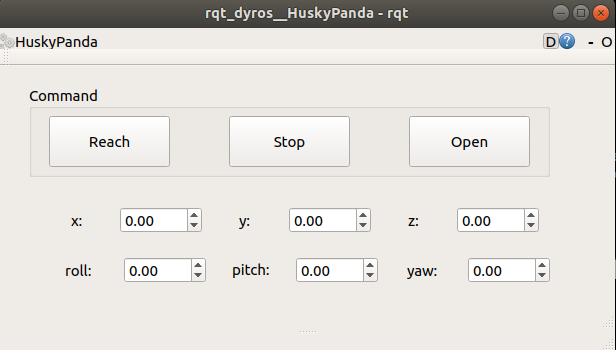

# rqt_dyros
## Custom rqt plugins which is written by the python language

### Image
---

---
### Build
```
cd ~/$(your workspace)
git clone https://github.com/Gyuhub/rqt_dyros.git
catkin make
source ~/$(your workspace)/devel/setup.bash
```

### Test
```
rosrun rqt_dyros rqt_dyros
```

### Description
* When you push the "Open", then the topic which has a name of "/open_push_button_pressed" and has a type of String is published once.
* When you spin the box of each "x, y, z" values and you push the "Reach", the the topic which has a name of "/reach_push_button_pressed" and has a type of Vector3 is published once.
